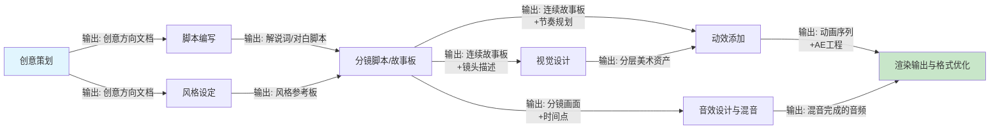

# MGFlow

MG动画基本流程：

```mermaid
flowchart LR
    A[创意策划] -->|输出: 创意方向文档| B[脚本编写]
    A -->|输出: 创意方向文档| C[风格设定]

    B -->|输出: 解说词/对白脚本| D[分镜脚本/故事板]
    C -->|输出: 风格参考板| D

    D -->|输出: 连续故事板<br>+镜头描述| E[视觉设计]
    D -->|输出: 连续故事板<br>+节奏规划| F[动效添加]
    D -->|输出: 分镜画面<br>+时间点| G[音效设计与混音]

    E -->|输出: 分层美术资产| F

    F -->|输出: 动画序列<br>+AE工程| H[渲染输出与格式优化]
    G -->|输出: 混音完成的音频| H

    style A fill:#e1f5fe
    style H fill:#c8e6c9
```
